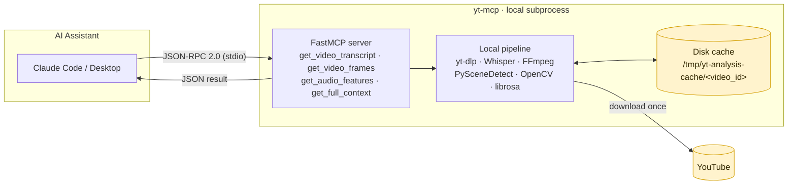
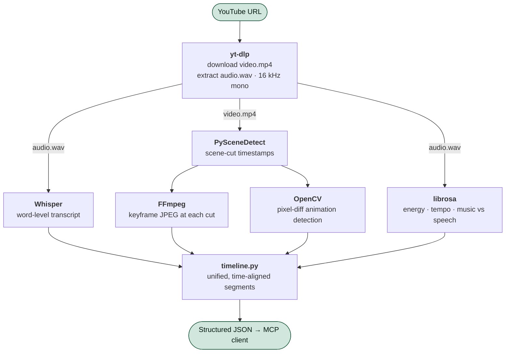
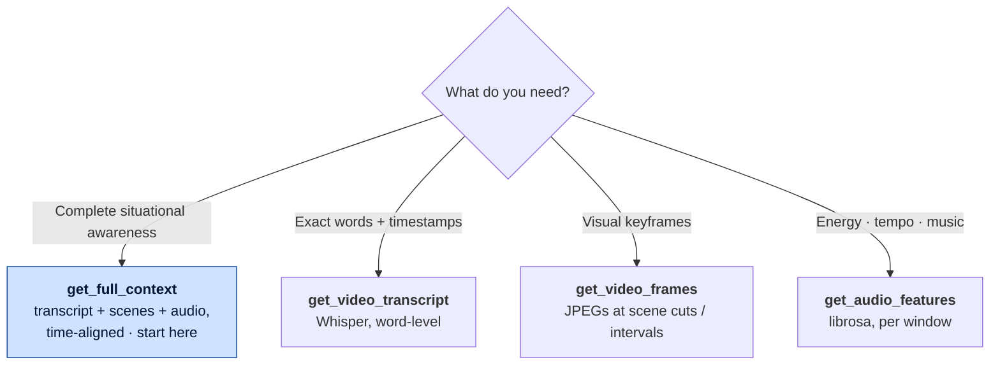

# yt-mcp

A fully local MCP (Model Context Protocol) server that gives AI assistants deep, multi-modal awareness of YouTube videos. **No API keys required.** All processing runs on-device via yt-dlp, OpenAI Whisper, FFmpeg, PySceneDetect, and librosa.

> **Note:** This repository also contains an experimental TypeScript server (`src/`) that uses the Gemini API. That server is **not under active development** — the Python local server (`server/`) is the primary implementation.

---

## Table of Contents

- [System overview](#system-overview)
- [How it works](#how-it-works)
- [Prerequisites](#prerequisites)
- [Installation](#installation)
- [MCP integration](#mcp-integration)
- [Tools](#tools)
- [Supported URL Formats](#supported-url-formats)
- [Environment Variables](#environment-variables)
- [Development](#development)
- [Testing](#testing)
- [Documentation](#documentation)
- [TypeScript Server (archived)](#typescript-server--archived)
- [License](#license)

---

## System overview

`yt-mcp` runs as a local subprocess that an AI assistant spawns and talks to over stdio using JSON-RPC 2.0. The assistant calls tools; the server downloads the video once, extracts multi-modal signals on-device, caches everything to disk, and returns structured JSON. No data leaves the machine except the one-time download from YouTube.



---

## How it works

A single download feeds three parallel analysis tracks, which `timeline.py` then re-aligns into one time-indexed JSON document.



All results are cached in `/tmp/yt-analysis-cache/<video_id>/`. Re-calling the same URL is instant — only the first call pays the download + transcription cost.

---

## Prerequisites

```bash
# macOS
brew install ffmpeg

# Ubuntu / Debian
sudo apt install ffmpeg

# Verify
ffmpeg -version
python3 --version   # must be 3.10+
```

---

## Installation

```bash
git clone https://github.com/yourusername/yt-mcp.git
cd yt-mcp

# Create and activate a virtual environment (recommended)
python3 -m venv .venv
source .venv/bin/activate        # macOS / Linux
# .venv\Scripts\activate         # Windows

pip install -r requirements.txt
```

Whisper model weights download automatically on the first transcription call (~142 MB for `base`, ~2.9 GB for `large`).

---

## MCP integration

MCP clients spawn the server as a subprocess — they do **not** activate your shell or venv automatically. You must point them at the venv's Python interpreter directly using its absolute path.

Find your interpreter path after activating the venv:
```bash
source .venv/bin/activate
which python   # e.g. /Users/you/repos/yt-mcp/.venv/bin/python
```

**Claude Code:**
```bash
claude mcp add -s user yt-mcp -- /path/to/yt-mcp/.venv/bin/python /path/to/yt-mcp/server/main.py
```

**Claude Desktop** — add to `~/Library/Application Support/Claude/claude_desktop_config.json`:
```json
{
  "mcpServers": {
    "yt-mcp": {
      "command": "/path/to/yt-mcp/.venv/bin/python",
      "args": ["/path/to/yt-mcp/server/main.py"]
    }
  }
}
```

> Replace `/path/to/yt-mcp` with the absolute path to wherever you cloned the repo.
> On Windows the interpreter is at `.venv\Scripts\python.exe`.

---

## Tools

The server exposes four tools. `get_full_context` is the primary one — it combines every signal into a single timeline. Reach for the others when you need just one modality or want to control token usage.



| Tool | Modality | Returns base64 images? | Safe for long videos? |
|---|---|---|---|
| `get_full_context` | All (transcript + scene + audio) | Only if `include_frames=true` | Yes (default `include_frames=false`) |
| `get_video_transcript` | Speech → text | No | Yes |
| `get_video_frames` | Visual | Yes (always) | Use on short clips / specific ranges |
| `get_audio_features` | Audio | No | Yes |

### `get_video_transcript`

Transcribe a YouTube video using OpenAI Whisper (runs entirely locally).

| Parameter | Type | Default | Description |
|-----------|------|---------|-------------|
| `youtube_url` | string | — | Full YouTube URL |
| `model_size` | string | `base` | `tiny` · `base` · `small` · `medium` · `large` |

**Response:**
```json
{
  "title": "Video Title",
  "duration": 847,
  "language": "en",
  "full_text": "Welcome to this video...",
  "segments": [
    {
      "t_start": 0.0,
      "t_end": 4.5,
      "text": "Welcome to this video.",
      "words": [{ "word": "Welcome", "start": 0.0, "end": 0.6 }]
    }
  ]
}
```

### `get_video_frames`

Extract keyframes as base64-encoded JPEGs. Uses PySceneDetect for scene detection and FFmpeg for extraction.

| Parameter | Type | Default | Description |
|-----------|------|---------|-------------|
| `youtube_url` | string | — | Full YouTube URL |
| `strategy` | string | `scene` | `scene` · `interval` · `both` |
| `interval` | integer | `30` | Seconds between frames (for `interval` or `both` strategies) |

**Response:**
```json
{
  "title": "Video Title",
  "duration": 847,
  "duration_formatted": "14:07",
  "frame_count": 12,
  "strategy": "scene",
  "frames": [
    {
      "t": 0.0,
      "t_formatted": "0:00",
      "keyframe": "<base64 JPEG>",
      "scene_change": false,
      "animation_detected": false
    }
  ],
  "summary": [ /* same list without keyframe bytes — for quick review */ ]
}
```

### `get_audio_features`

Analyze audio characteristics using librosa (runs locally).

| Parameter | Type | Default | Description |
|-----------|------|---------|-------------|
| `youtube_url` | string | — | Full YouTube URL |
| `segment_duration` | integer | `30` | Analysis window size in seconds |

**Response:**
```json
{
  "title": "Video Title",
  "duration": 847,
  "segment_duration": 30,
  "segments": [
    {
      "t_start": 0.0,
      "t_end": 30.0,
      "energy": "medium",
      "music": false,
      "tempo_bpm": 95.0,
      "rms_db": -22.1
    }
  ]
}
```

### `get_full_context`

**Primary tool.** Returns a complete, synchronized multi-modal timeline — transcript + scene boundaries + animation detection + audio features, all time-aligned.

| Parameter | Type | Default | Description |
|-----------|------|---------|-------------|
| `youtube_url` | string | — | Full YouTube URL |
| `include_frames` | boolean | `false` | Embed base64 keyframes per segment |
| `model_size` | string | `base` | Whisper model size |

**Response:**
```json
{
  "title": "How Transformers Work",
  "channel": "AI Explained",
  "duration": 847,
  "duration_formatted": "14:07",
  "language": "en",
  "description": "In this video...",
  "segments": [
    {
      "t_start": 0.0,
      "t_end": 12.0,
      "transcript": "Welcome to this video on transformers...",
      "keyframe": null,
      "scene_change": false,
      "animation_detected": false,
      "audio": {
        "energy": "low",
        "speech_rate": "normal",
        "music": true,
        "tempo_bpm": 0.0,
        "rms_db": -28.4
      }
    }
  ]
}
```

> **Context window tip:** Call `get_full_context` with `include_frames=false` first to understand the video structure, then call `get_video_frames` for specific timestamps of interest.

---

## Supported URL Formats

```
https://www.youtube.com/watch?v=VIDEO_ID
https://youtu.be/VIDEO_ID
https://youtube.com/shorts/VIDEO_ID
```

---

## Environment Variables

| Variable | Default | Description |
|----------|---------|-------------|
| `YT_CACHE_DIR` | `/tmp/yt-analysis-cache` | Cache directory for downloaded videos and audio |

---

## Development

```bash
# Activate the venv first
source .venv/bin/activate

# Run the server directly (stdio mode — same as MCP clients use)
python server/main.py

# Quick smoke test
python -c "
from server.utils.downloader import VideoDownloader
from server.tools.transcript import get_transcript
d = VideoDownloader()
vp, ap, info = d.download('https://www.youtube.com/watch?v=jNQXAC9IVRw')
print(get_transcript(ap)['language'])
"
```

---

## Testing

The Python server has a full unit test suite — 164 tests across 6 modules. All tests run without any network access or model downloads; every external dependency (Whisper, librosa, FFmpeg, PySceneDetect, OpenCV, yt-dlp) is mocked.

### Install test dependencies

```bash
pip install -r requirements-dev.txt
```

### Run the full suite

```bash
python -m pytest
```

Expected output: `164 passed in ~4s`

### Run tests for a specific module

```bash
python -m pytest tests/test_downloader.py   # VideoDownloader + VideoInfo
python -m pytest tests/test_transcript.py   # Whisper wrapper + range helpers
python -m pytest tests/test_frames.py       # FFmpeg, PySceneDetect, OpenCV
python -m pytest tests/test_audio.py        # librosa AudioAnalyzer
python -m pytest tests/test_timeline.py     # build_timeline + speech rate
python -m pytest tests/test_main.py         # all 4 MCP tool handlers
```

### Run a single test by name

```bash
python -m pytest tests/test_timeline.py::TestBuildTimeline::test_rapid_cuts_below_min_merged -v
```

### Live smoke test against a real video

The example below uses [プリマドンナ / 星街すいせい](https://www.youtube.com/watch?v=M1GYqy0tHV0) (Hoshimachi Suisei · Suisei Channel, 2:52) — a Japanese music video that exercises every layer of the pipeline: multilingual Whisper transcription, music detection via librosa HPSS, rapid scene cuts via PySceneDetect, and animation detection via OpenCV pixel-diff.

```python
from server.utils.downloader import VideoDownloader
from server.tools.transcript import get_transcript
from server.tools.audio import AudioAnalyzer
from server.tools.frames import detect_scene_timestamps

URL = "https://www.youtube.com/watch?v=M1GYqy0tHV0"

d = VideoDownloader()
video_path, audio_path, info = d.download(URL)

print(f"Title:    {info.title}")        # プリマドンナ / 星街すいせい(official)
print(f"Duration: {info.duration:.0f}s")  # 172

transcript = get_transcript(audio_path, model_size="base")
print(f"Language: {transcript['language']}")  # ja

cuts = detect_scene_timestamps(video_path)
print(f"Scene cuts detected: {len(cuts)}")    # typically 30–60 for a music video

analyzer = AudioAnalyzer(audio_path)
seg = analyzer.analyze_segment(0, 30)
print(f"First 30s — energy: {seg['energy']}, music: {seg['music']}")
# energy: 'medium' or 'high', music: True
```

For the full test guide — fixtures, mock patterns, writing tests for new tools — see [**docs/testing.md**](docs/testing.md).

---

## Documentation

| Document | What it covers |
|---|---|
| [**SPEC.md**](SPEC.md) | Formal specification — tool contracts, data schemas, algorithms, thresholds, and the error model. The authoritative reference. |
| [**docs/architecture.md**](docs/architecture.md) | System design, data-flow and UML diagrams, and key design decisions |
| [**docs/python-server.md**](docs/python-server.md) | Component reference for every module |
| [**docs/extending.md**](docs/extending.md) | How to add new tools |
| [**docs/testing.md**](docs/testing.md) | Test suite structure, fixtures, and writing new tests |

---

## TypeScript Server (archived)

The `src/` directory contains an experimental TypeScript server that delegates video analysis to the Gemini API. It is **not under active development** and is kept only for reference.

If you're looking for fast cloud-based video Q&A, the TypeScript server's approach (passing the YouTube URL directly to Gemini) works well for a quick prototype — but the Python server is the only implementation that will receive ongoing maintenance.

See [docs/typescript-server.md](docs/typescript-server.md) for its API reference.

---

## License

[MIT](LICENSE)
