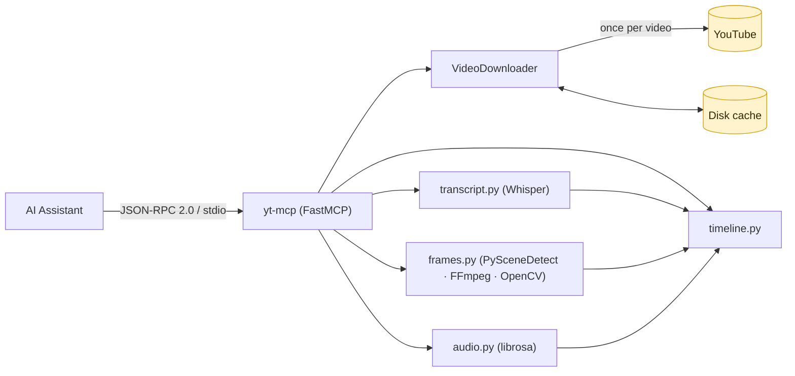
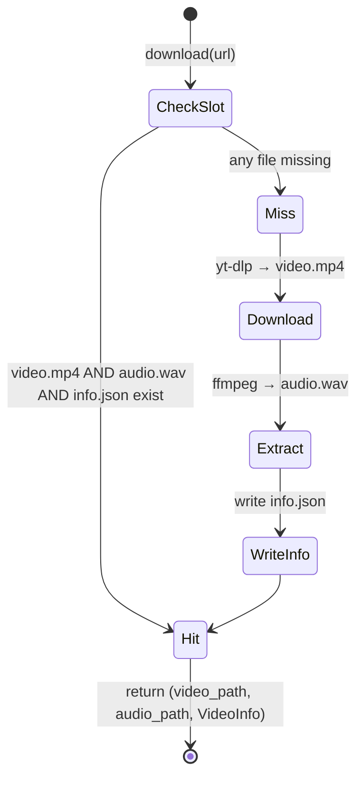
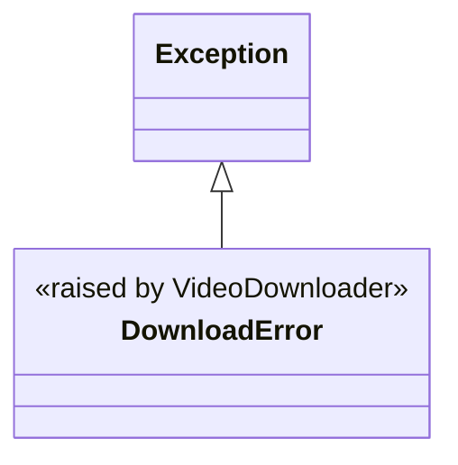

# yt-mcp — Specification

> **Status:** Living specification · **Last updated:** 2026-06-05
> **Applies to:** Python server (`server/`, primary) and the archived TypeScript server (`src/`)

This document is the authoritative reference for what `yt-mcp` does and how it behaves: the MCP interface it exposes, the exact shape of every tool's input and output, the algorithms and thresholds behind each signal, the caching and error models, and the configuration surface. Prose explanations and rationale live in [docs/architecture.md](docs/architecture.md); this file is the contract.

When the code and this document disagree, the code is correct — please open a change to reconcile them.

---

## Table of Contents

1. [Scope and goals](#1-scope-and-goals)
2. [Terminology](#2-terminology)
3. [System model](#3-system-model)
4. [MCP interface](#4-mcp-interface)
5. [Python tool specifications](#5-python-tool-specifications)
6. [Data schemas](#6-data-schemas)
7. [Pipeline algorithms and thresholds](#7-pipeline-algorithms-and-thresholds)
8. [Caching model](#8-caching-model)
9. [Configuration](#9-configuration)
10. [Error model](#10-error-model)
11. [Resource and performance characteristics](#11-resource-and-performance-characteristics)
12. [TypeScript server (archived)](#12-typescript-server-archived)
13. [Compatibility and dependencies](#13-compatibility-and-dependencies)
14. [Non-goals and limitations](#14-non-goals-and-limitations)

---

## 1. Scope and goals

`yt-mcp` is a Model Context Protocol (MCP) server that gives an AI assistant deep, multi-modal awareness of a YouTube video: what is said (transcript), what is shown (keyframes, scene cuts, motion), and what is heard (energy, tempo, music vs speech).

The **Python server** is the primary, supported implementation. Its design goals, in priority order:

1. **Fully local.** No API keys. The only network access is the one-time video download from YouTube.
2. **Verifiable ground truth.** Outputs are measured signals (word timestamps, dB levels, pixel diffs), not LLM-generated approximations.
3. **Deterministic and cacheable.** The same URL yields the same result, and re-analysis is served from disk.
4. **Context-window aware.** Heavy payloads (base64 frames) are opt-in so the default responses are safe for any video length.

The **TypeScript server** is an archived, cloud-based alternative that delegates understanding to the Gemini API. It is documented here for completeness ([§12](#12-typescript-server-archived)) but is not under active development.

---

## 2. Terminology

| Term | Meaning |
|---|---|
| **Tool** | An MCP-exposed callable the assistant can invoke by name with JSON arguments. |
| **Segment** | A `[t_start, t_end]` time window with attached signals. |
| **Scene cut** | A timestamp where PySceneDetect reports a content discontinuity. |
| **Keyframe** | A single JPEG frame extracted at a given timestamp, base64-encoded. |
| **Cache slot** | The directory `<cache_dir>/<video_id>/` holding a video's derived artifacts. |
| **Signal** | One measured modality: transcript text, audio features, scene boundary, animation flag, keyframe. |
| `t`, `t_start`, `t_end` | Times in **seconds** (floating point) from the start of the video. |

---

## 3. System model



- The server is launched as a child process by the MCP client and speaks JSON-RPC 2.0 over stdin/stdout.
- A single module-level `VideoDownloader` instance is shared across all tools, so the disk cache is reused within a session.
- Every tool downloads (or cache-loads) first, then runs only the analysis it needs.

---

## 4. MCP interface

| Property | Value |
|---|---|
| Server name | `yt-mcp` |
| Framework | [FastMCP](https://github.com/jlowin/fastmcp) (`mcp.server.fastmcp.FastMCP`) |
| Transport | stdio (JSON-RPC 2.0 over stdin/stdout) |
| Tool count | 4 |
| Tool return type | A single JSON **string** (the tool serializes its own response via `json.dumps(..., ensure_ascii=False)`) |
| `stderr` | Diagnostic logging only; never read by the client |

**Invariants:**

- **I-1 — Always-valid JSON.** Every tool returns a string parseable by `json.loads`. On any handled failure the string is `{"error": "<message>"}`. A raw Python traceback must never reach the client.
- **I-2 — Non-ASCII preserved.** Responses are serialized with `ensure_ascii=False` so multilingual transcripts survive round-trips.
- **I-3 — Download-first.** Every tool calls `downloader.download(url)` before any analysis; a download/`ffmpeg` failure short-circuits to an error response.

---

## 5. Python tool specifications

All tools accept `youtube_url` as the first parameter and return a JSON string.

### 5.1 `get_video_transcript`

Transcribe the video with OpenAI Whisper, locally.

| Parameter | Type | Default | Constraints |
|---|---|---|---|
| `youtube_url` | string | — | A [supported URL](#supported-url-formats) |
| `model_size` | string | `"base"` | `tiny` \| `base` \| `small` \| `medium` \| `large` |

**Success response:**

```json
{
  "title": "string",
  "duration": 847.0,
  "language": "en",
  "full_text": "string",
  "segments": [ /* Transcript Segment objects — see §6.2 */ ]
}
```

### 5.2 `get_video_frames`

Extract keyframes as base64 JPEGs, with per-frame scene-cut and animation flags.

| Parameter | Type | Default | Constraints |
|---|---|---|---|
| `youtube_url` | string | — | A supported URL |
| `strategy` | string | `"scene"` | `scene` \| `interval` \| `both` (else → error) |
| `interval` | integer | `30` | Seconds between frames for `interval`/`both` |

**Success response:**

```json
{
  "title": "string",
  "duration": 847.0,
  "duration_formatted": "14:07",
  "frame_count": 12,
  "strategy": "scene",
  "frames":  [ /* Frame objects WITH keyframe bytes — see §6.3 */ ],
  "summary": [ /* same objects WITHOUT the keyframe field */ ]
}
```

> `summary` duplicates `frames` minus the base64 bytes so a client can review structure cheaply before deciding whether to read the images.

### 5.3 `get_audio_features`

Per-window audio analysis with librosa.

| Parameter | Type | Default | Constraints |
|---|---|---|---|
| `youtube_url` | string | — | A supported URL |
| `segment_duration` | integer | `30` | Window size in seconds |

**Success response:**

```json
{
  "title": "string",
  "duration": 847.0,
  "segment_duration": 30,
  "segments": [ /* Audio Window objects — see §6.4 */ ]
}
```

### 5.4 `get_full_context`

**Primary tool.** Returns one synchronized, time-aligned timeline combining transcript, scene boundaries, animation detection, and audio features.

| Parameter | Type | Default | Constraints |
|---|---|---|---|
| `youtube_url` | string | — | A supported URL |
| `include_frames` | boolean | `false` | Embed a base64 keyframe per segment |
| `model_size` | string | `"base"` | Whisper model size |

**Success response:**

```json
{
  "title": "string",
  "channel": "string",
  "duration": 847.0,
  "duration_formatted": "14:07",
  "language": "en",
  "description": "first 500 chars",
  "segments": [ /* Timeline Segment objects — see §6.5 */ ]
}
```

> **Context budget:** keep `include_frames=false` (default) for long videos; call `get_video_frames` for specific moments instead. See [§11](#11-resource-and-performance-characteristics).

<a name="supported-url-formats"></a>

### 5.5 Supported URL formats

```
https://www.youtube.com/watch?v=VIDEO_ID
https://youtu.be/VIDEO_ID
https://youtube.com/shorts/VIDEO_ID
```

The Python server passes the URL to yt-dlp, which is liberal about formats; the canonical video ID comes from `yt_dlp.extract_info()`. The TypeScript server enforces the stricter regex in [§12.4](#124-input-validation).

---

## 6. Data schemas

### 6.1 `VideoInfo`

Produced by `VideoDownloader`; the metadata block at the top of most responses is derived from it.

| Field | Type | Notes |
|---|---|---|
| `id` | string | YouTube video ID (e.g. `dQw4w9WgXcQ`) |
| `title` | string | |
| `duration` | float | Seconds; `0` if yt-dlp omits it |
| `channel` | string | Uploader name (from yt-dlp `uploader`) |
| `upload_date` | string | `YYYYMMDD` |
| `description` | string | **Truncated to the first 500 characters** |
| `url` | string | The URL passed to `download()` |

### 6.2 Transcript Segment

```json
{
  "t_start": 0.0,
  "t_end": 4.5,
  "text": "Welcome to this video.",
  "words": [
    { "word": "Welcome", "start": 0.0, "end": 0.6 }
  ]
}
```

- All times are floats in seconds, **rounded to 3 decimals**.
- `word` is whitespace-stripped. `words` may be empty for some segments.

### 6.3 Frame

```json
{
  "t": 12.0,
  "t_formatted": "0:12",
  "keyframe": "<base64 JPEG>",
  "scene_change": true,
  "animation_detected": false
}
```

- `keyframe` is a base64-encoded JPEG (≤ 1280 px wide). A frame whose extraction fails is **omitted entirely** (not emitted with `null`).
- `scene_change` is `true` iff `t` is one of the detected scene-cut timestamps.

### 6.4 Audio Window (`get_audio_features`)

```json
{
  "t_start": 0.0,
  "t_end": 30.0,
  "energy": "medium",
  "music": false,
  "tempo_bpm": 95.0,
  "rms_db": -22.1
}
```

### 6.5 Timeline Segment (`get_full_context`)

```json
{
  "t_start": 0.0,
  "t_end": 12.0,
  "transcript": "Welcome to this video on transformers...",
  "keyframe": null,
  "scene_change": false,
  "animation_detected": false,
  "audio": {
    "energy": "low",
    "speech_rate": "normal",
    "music": true,
    "tempo_bpm": 0.0,
    "rms_db": -28.4
  }
}
```

- `keyframe` is `null` unless `include_frames=true`.
- `scene_change` is `false` for the first segment and `true` for every later segment (each later boundary is a retained scene cut).
- `audio` is the [§6.6](#66-audio-features-core) object **plus** a `speech_rate` field.

### 6.6 Audio Features (core)

The shared object returned by `AudioAnalyzer.analyze_segment`:

| Field | Type | Domain |
|---|---|---|
| `energy` | string | `"low"` \| `"medium"` \| `"high"` |
| `music` | bool | |
| `tempo_bpm` | float | `0.0` when undetermined; rounded to 1 decimal |
| `rms_db` | float | Rounded to 1 decimal |

When wrapped into a Timeline Segment, `speech_rate` (`"slow"` \| `"normal"` \| `"fast"` \| `"unknown"`) is added.

---

## 7. Pipeline algorithms and thresholds

This section is the source of truth for every magic number. All are defined in `server/`.

### 7.1 Download and audio extraction (`utils/downloader.py`)

- **Format selection:** `bestvideo[ext=mp4]+bestaudio[ext=m4a]/best[ext=mp4]/best`, merged to `mp4`. yt-dlp output is normalized to `video.mp4` if it lands with another extension.
- **Audio extraction:** `ffmpeg -y -i video.mp4 -vn -acodec pcm_s16le -ar 16000 -ac 1 audio.wav` → 16 kHz, mono, signed-16-bit PCM WAV.
- **Cache key:** the yt-dlp video `id`.
- **Cache validity:** a slot is a hit only if **all three** of `video.mp4`, `audio.wav`, `info.json` exist; otherwise the full pipeline re-runs. See [§8](#8-caching-model).

### 7.2 Transcription (`tools/transcript.py`)

- Calls `whisper.load_model(size).transcribe(audio_path, word_timestamps=True, verbose=False)`.
- Loaded models are memoized in a module-level `_model_cache` keyed by size.
- `language` is the Whisper-detected language code (`"unknown"` if absent).
- `get_text_in_range(t_start, t_end)` joins the text of every segment that **overlaps** the window (`seg.t_end > t_start AND seg.t_start < t_end`).
- `count_words_in_range(t_start, t_end)` counts word-level entries whose `[start, end]` overlaps the window.

### 7.3 Scene detection & frames (`tools/frames.py`)

| Operation | Detail |
|---|---|
| Scene cuts | PySceneDetect `ContentDetector(threshold=27.0)`; returns sorted unique `start.get_seconds()` rounded to 3 decimals. |
| Frame extraction | `ffmpeg -y -ss <t> -i <video> -vframes 1 -vf scale=1280:-1 -q:v 3 <tmp.jpg>`; returns `None` (frame dropped) if `ffmpeg` fails or the output is empty. |
| Duration | `ffprobe` JSON; first video stream's `duration`, else `0.0`. |
| Animation | Sample **5** frames evenly across the window, grayscale, mean of adjacent-frame `absdiff / 255`. **Animation = mean > 0.03 (3%).** Needs ≥ 2 decoded frames, else `false`. |

**`get_keyframes(strategy, interval=30, frame_width=1280)` timestamp construction:**

1. `scene` / `both` → include all scene-cut times.
2. `interval` / `both` → include `0, interval, 2·interval, …` while `< duration`.
3. `t=0.0` is always included.
4. Deduplicate (round to 3 decimals), drop any `t ≥ duration`, sort ascending.
5. For each `t`: extract the frame; set `t_next` = next timestamp (or `min(t+10, duration)`); run animation detection only if `t_next - t > 1.0`.

### 7.4 Audio features (`tools/audio.py`)

`AudioAnalyzer` loads the whole WAV once via `librosa.load(path, sr=16000, mono=True)` and slices the in-memory array per segment.

- **Too-short guard:** a segment with `< sr/10` samples (< 100 ms) returns `{"energy": "low", "music": false, "tempo_bpm": 0.0, "rms_db": -60.0}` without analysis.
- **Energy** from RMS → dB (`librosa.feature.rms` mean → `amplitude_to_db`):

  | RMS dB | `energy` |
  |---|---|
  | `< -35` | `low` |
  | `-35 ≤ dB < -18` | `medium` |
  | `≥ -18` | `high` |

- **Tempo:** `librosa.beat.beat_track`; `0.0` on failure (common for speech-only audio).
- **Music detection** (both conditions required):
  - `harmonic_ratio > 0.25` — harmonic energy share from `librosa.effects.hpss`.
  - `spectral_flatness < 0.15` — from `librosa.feature.spectral_flatness`.
  - Any exception → `music = false`.

### 7.5 Timeline assembly (`tools/timeline.py`)

`build_timeline(video_path, audio_path, transcript, include_frames=false, min_segment_sec=5.0)`:

1. Read `duration`; get scene-cut times.
2. Build boundaries starting at `[0.0]`. Append a cut `t` only if `t - boundaries[-1] ≥ min_segment_sec` (collapses rapid cuts).
3. If the last boundary is `< duration - 0.5`, append `duration`.
4. For each consecutive pair `[t_start, t_end]`:
   - `transcript` ← `get_text_in_range`.
   - `speech_rate` ← from `count_words_in_range` and segment length.
   - `keyframe` ← `extract_frame_as_base64(t_start)` only if `include_frames`, else `null`.
   - `animation_detected` ← `detect_animation` only if segment length `> 2.0 s`, else `false`.
   - `audio` ← `analyze_segment` (+ `speech_rate`).
   - `scene_change` ← `index > 0`.
   - `t_start` / `t_end` rounded to 3 decimals.

**Speech-rate classification** (words per minute):

| WPM | `speech_rate` |
|---|---|
| segment length `≤ 0` | `unknown` |
| `< 100` | `slow` |
| `100 ≤ wpm < 160` | `normal` |
| `≥ 160` | `fast` |

---

## 8. Caching model



**Cache slot layout** (`<cache_dir>/<video_id>/`):

| File | Contents |
|---|---|
| `video.mp4` | Downloaded video (normalized to mp4) |
| `audio.wav` | 16 kHz mono PCM WAV extracted from the video |
| `info.json` | Serialized `VideoInfo` fields (the `url` field is overwritten with the current request URL on a cache hit) |

- Default `cache_dir` is `/tmp/yt-analysis-cache`; override with `YT_CACHE_DIR` for persistence across reboots.
- `VideoDownloader.clear_cache(video_id)` removes a single slot.
- Whisper weights are cached **separately** by the Whisper library in `~/.cache/whisper/`.

---

## 9. Configuration

### Python server

| Variable | Default | Description |
|---|---|---|
| `YT_CACHE_DIR` | `/tmp/yt-analysis-cache` | Cache directory for downloaded videos and audio |

No API keys are required or read.

### TypeScript server (archived)

| Variable | Required | Default | Description |
|---|---|---|---|
| `GEMINI_API_KEY` | Yes | — | Google Gemini API key; server exits on startup if missing |
| `GEMINI_MODEL` | No | `gemini-3-flash-preview` | Model override |
| `YOUTUBE_API_KEY` | No | falls back to `GEMINI_API_KEY` | YouTube Data API v3 key for metadata |
| `SCREENSHOT_OUTPUT_DIR` | No | temp dir | Persistent output directory for saved frames |

---

## 10. Error model

### 10.1 Python server

Every tool returns `{"error": "<message>"}` (HTTP-style status is not used; the string is still valid JSON per [I-1](#4-mcp-interface)). Each pipeline stage is independently guarded:

| Failure | Trigger | Message shape |
|---|---|---|
| Download failure | `DownloadError` from `download()` | `str(e)` (wraps the yt-dlp/ffmpeg cause) |
| `ffmpeg` missing | `FileNotFoundError` from `download()` | `"ffmpeg not found — install it: brew install ffmpeg"` |
| Invalid `strategy` | `get_video_frames` only | `"strategy must be 'scene', 'interval', or 'both'"` |
| Transcription failure | exception in `get_transcript` | `"Transcription failed: <e>"` |
| Frame failure | exception in `get_keyframes` | `"Frame extraction failed: <e>"` |
| Audio failure | exception in `AudioAnalyzer`/`analyze_full` | `"Audio analysis failed: <e>"` |
| Timeline failure | exception in `build_timeline` | `"Timeline build failed: <e>"` |

**Error type hierarchy:**



Internally, individual frame and tempo/music computations degrade gracefully (a dropped frame is omitted; an undetectable tempo is `0.0`) rather than failing the whole call.

### 10.2 TypeScript server

Errors return `{ content: [{ type: "text", text }], isError: true }`. The text is prefixed by type: `Validation error:` (Zod), `Dependency error:` (`DependencyError`), `Screenshot extraction failed:` (`ScreenshotExtractionError`), or the raw message for `VideoAnalysisError` / `VideoAccessError`. Screenshot extraction is **partial-failure tolerant** — it returns the frames that succeeded and only throws if *all* timestamps fail.

---

## 11. Resource and performance characteristics

| Aspect | Characteristic |
|---|---|
| First call | Pays download + audio extraction + Whisper transcription. Dominated by Whisper on CPU. |
| Repeat calls | Served from the disk cache; near-instant download stage. |
| Audio RAM | The full WAV is held in memory: 16 kHz mono ≈ **~115 MB per 60 minutes**. |
| Whisper weights | tiny ~75 MB · base ~142 MB · small ~466 MB · medium ~1.5 GB · large ~2.9 GB (downloaded once to `~/.cache/whisper/`). |
| Frame payload | One base64 JPEG (≤ 1280 px) ≈ **80–150 KB** of text. |

**Context-window guidance:** A 30-minute video with a cut every ~10 s yields ~180 frames ≈ 15–25 MB of base64 if embedded. Therefore `include_frames` defaults to `false`, and the timeline's 5-second minimum segment ([§7.5](#75-timeline-assembly-toolstimelinepy)) bounds segment count. Use `get_full_context` (no frames) to map a video, then `get_video_frames` for specific ranges.

---

## 12. TypeScript server (archived)

> Not under active development. Kept for reference. The Python server is the implementation to use.

### 12.1 Model

Gemini understands YouTube URLs natively, so `summarize_video` and `ask_about_video` send only the URL (`fileData.fileUri`) — no local download. Screenshot tools use yt-dlp (`-g`, stream URL only) + ffmpeg locally.

| Property | Value |
|---|---|
| Server name / version | `yt-mcp` / `0.1.0` |
| SDK | `@modelcontextprotocol/sdk` |
| Transport | stdio |
| Tool count | 5 |

### 12.2 Tools

| Tool | Required | Optional |
|---|---|---|
| `summarize_video` | `youtube_url` | `detail_level` (`brief`\|`medium`\|`detailed`, default `medium`) |
| `ask_about_video` | `youtube_url`, `question` | — |
| `extract_screenshots` | `youtube_url` | `count` (1–20, default 5), `output_dir`, `focus`, `resolution` |
| `get_video_timestamps` | `youtube_url` | `count` (1–20, default 5), `focus` |
| `extract_frames` | `youtube_url`, `timestamps[]` (1–20, ≥ 0) | `output_dir`, `resolution` |

### 12.3 Resolution mapping

| `resolution` | Frame height |
|---|---|
| `thumbnail` | 160 px |
| `small` | 360 px |
| `medium` | 720 px |
| `large` (default) | 1080 px |
| `full` | Original (no scaling) |

### 12.4 Input validation

All inputs pass through Zod schemas in `src/validators.ts` before any API call. The accepted URL pattern:

```
/^https?:\/\/(?:www\.)?(?:youtube\.com\/(?:watch\?v=|shorts\/)|youtu\.be\/)[\w-]+/
```

`extractVideoId()` resolves `youtube.com/watch?v=`, `youtu.be/`, and `youtube.com/shorts/` to the bare video ID.

See [docs/typescript-server.md](docs/typescript-server.md) for the full component reference.

---

## 13. Compatibility and dependencies

### Python server

| Requirement | Version |
|---|---|
| Python | 3.10+ |
| FFmpeg (incl. `ffprobe`) | on `PATH` |
| `mcp` | ≥ 1.0.0 |
| `yt-dlp` | ≥ 2024.1.1 |
| `openai-whisper` | ≥ 20231117 |
| `librosa` | ≥ 0.10.0 |
| `numpy` | ≥ 1.24.0 |
| `soundfile` | ≥ 0.12.0 |
| `scipy` | ≥ 1.11.0 |
| `scenedetect[opencv]` | ≥ 0.6.0 |
| `opencv-python` | ≥ 4.8.0 |

Dev/test: `pytest ≥ 7.4.0`, `pytest-mock ≥ 3.12.0`.

### TypeScript server

Node ≥ 18; `@google/genai`, `@modelcontextprotocol/sdk`, `googleapis`, `zod` (see `package.json`).

---

## 14. Non-goals and limitations

- **No semantic understanding in the Python server.** It emits measured signals; summarization/Q&A belong to the assistant (or the archived TS server). To build semantic features, feed the structured JSON to an LLM in your application layer — see [docs/extending.md](docs/extending.md).
- **No streaming / incremental output.** A tool call returns once the requested analysis is complete.
- **No authentication or private videos.** Access is whatever yt-dlp can reach anonymously; private/geo-restricted videos surface as `DownloadError`.
- **Heuristic audio classification.** Music-vs-speech and energy labels are threshold-based ([§7.4](#74-audio-features-toolsaudiopy)) and tuned empirically for typical YouTube content; they are not a trained classifier.
- **`description` is truncated** to 500 characters by design ([§6.1](#61-videoinfo)).
- **`tempo_bpm` is best-effort** and is `0.0` whenever beat tracking is inconclusive.
