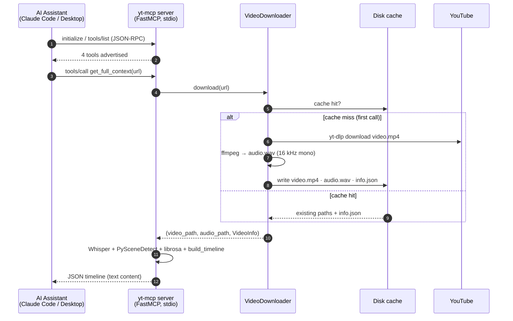
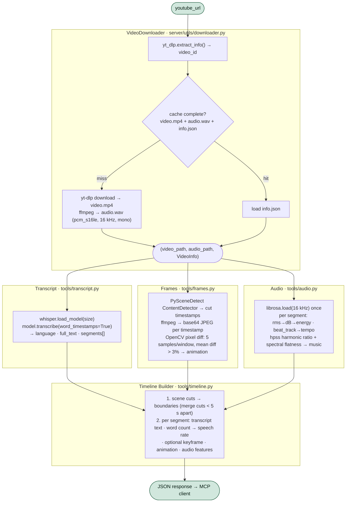
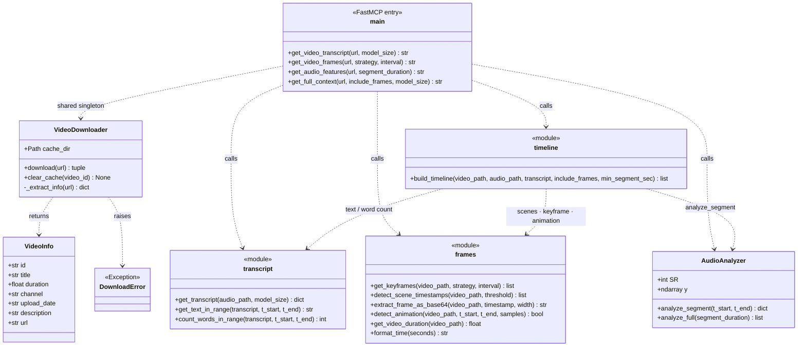
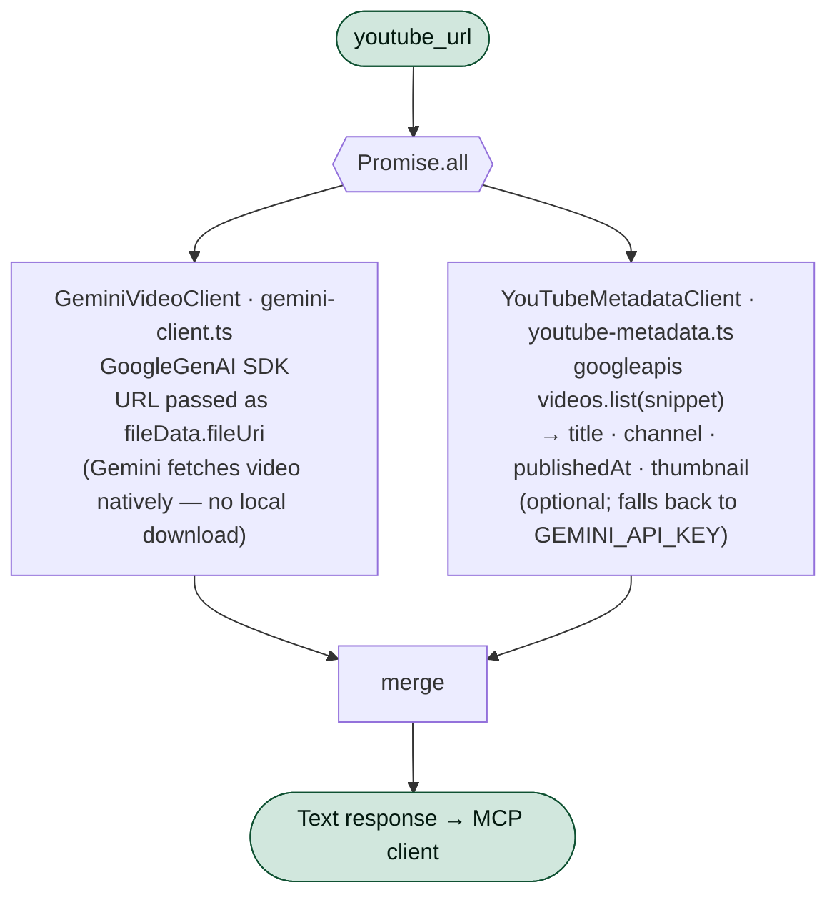
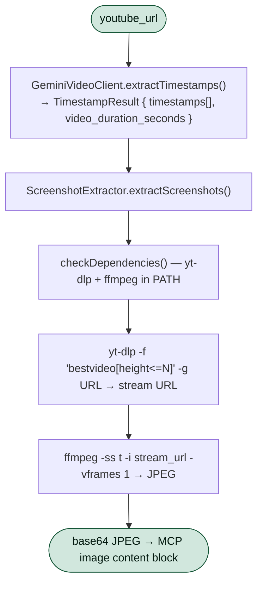

# Architecture Overview

This document explains the overall system design of `yt-mcp`, the data flow through the processing pipeline, and the key design decisions made along the way.

> **Scope:** This document covers the Python server (`server/`), which is the primary implementation. The TypeScript server (`src/`) is not under active development; its design is described briefly at the [end of this document](#typescript-server--not-actively-developed) for reference.

---

## How the server fits into MCP

`yt-mcp` is a local MCP server. The AI assistant (Claude Code or Claude Desktop) spawns it as a subprocess and communicates over stdin/stdout via JSON-RPC 2.0. The server holds no network ports and requires no API keys — every dependency (FFmpeg, Whisper, PySceneDetect, librosa) runs on-device.

The diagram below shows a typical `get_full_context` call. The first call pays the download + transcription cost; every later call for the same video is served from the on-disk cache.



> Errors never escape as tracebacks: each pipeline stage is wrapped so the assistant always receives a structured `{"error": "..."}` payload instead. See [Error taxonomy](#error-taxonomy).

---

## Python Server Pipeline

### End-to-end data flow

`get_full_context` is the widest path through the system: it touches every stage. The other three tools are slices of the same graph (transcript-only, frames-only, audio-only).



### Module map

```
server/
├── main.py               — FastMCP entry point; registers 4 tools
│                           handles errors and serializes responses
├── utils/
│   └── downloader.py     — VideoDownloader: yt-dlp + ffmpeg wrapper
│                           VideoInfo: metadata value object
│                           DownloadError: typed error class
└── tools/
    ├── transcript.py     — Whisper wrapper; in-process model cache
    ├── frames.py         — PySceneDetect, FFmpeg, OpenCV functions
    ├── audio.py          — AudioAnalyzer class (librosa)
    └── timeline.py       — build_timeline(): merges all signals
```

### Component model (UML)

The runtime is built from one stateful downloader, one audio analyzer instantiated per call, three stateless tool modules, and the FastMCP entry point that wires them together. `main.py` holds a single shared `VideoDownloader` so the disk cache is reused across every tool call in a session.



### Caching strategy

The downloader caches by YouTube video ID. The cache layout is:

```
/tmp/yt-analysis-cache/
└── <video_id>/
    ├── video.mp4    — original downloaded video
    ├── audio.wav    — 16kHz mono WAV extracted from video
    └── info.json    — serialized VideoInfo fields
```

All three files must exist for the cache to be considered valid. If any is missing, the full download+extraction pipeline runs again. The `YT_CACHE_DIR` environment variable lets you point to persistent storage so the cache survives reboots.

Whisper model weights are cached separately by the Whisper library in `~/.cache/whisper/`.

### Audio analysis design

The `AudioAnalyzer` class loads the full WAV file once into memory via `librosa.load` and then slices numpy arrays for each segment. This is much faster than re-reading the file per window, and 16kHz mono audio is compact — a 60-minute video is about 115 MB in RAM.

**Music vs speech detection** uses two complementary heuristics:

- **Harmonic ratio**: librosa's HPSS (Harmonic-Percussive Source Separation) splits the signal; speech is weakly harmonic while music is strongly harmonic.
- **Spectral flatness**: speech has uneven spectral distribution (peaks at formants); music is broader but more structured.

A segment is classified as music when `harmonic_ratio > 0.25 AND spectral_flatness < 0.15`. These thresholds were chosen empirically and can be adjusted in `audio.py`.

---

## TypeScript Server (not actively developed)

> The TypeScript server (`src/`) is kept for reference only and is not under active development. The Python server above is the implementation to use.

### End-to-end data flow

For `summarize_video` and `ask_about_video`, metadata and analysis are fetched concurrently and merged:



The screenshot tools (`extract_screenshots`, `get_video_timestamps`, `extract_frames`) take a different path — Gemini picks timestamps, then frames are pulled locally:



### Module map

```
src/
├── index.ts              — MCP Server entry point; routes tool calls
├── tools.ts              — TOOLS array: JSON Schema definitions for MCP
├── validators.ts         — Zod schemas for all tool inputs; URL parsing
├── gemini-client.ts      — GeminiVideoClient: wraps @google/genai SDK
│                           VideoAnalysisError, VideoAccessError
├── screenshot-extractor.ts — ScreenshotExtractor: yt-dlp + ffmpeg wrapper
│                             DependencyError, ScreenshotExtractionError
└── youtube-metadata.ts   — YouTubeMetadataClient: googleapis wrapper
```

### Input validation

All tool inputs pass through [Zod](https://zod.dev) schemas defined in `validators.ts` before reaching any business logic. This provides:
- Clear, machine-readable error messages surfaced directly in the MCP response
- A single source of truth for valid URL formats (the `YOUTUBE_URL_REGEX`)
- Type inference from schema to implementation — `z.infer<typeof SummarizeInputSchema>` gives a fully typed object

### Error taxonomy

The Python server uses a typed error hierarchy to produce actionable user-facing messages:

```
Exception
└── DownloadError          — yt-dlp or ffmpeg failure
```

All errors are caught at the MCP handler layer and serialized so the AI assistant always sees a structured `{"error": "..."}` message rather than a raw Python traceback.

---

## MCP Transport

Both servers use **stdio transport** (standard input/output). The MCP client spawns the server as a subprocess and communicates via JSON-RPC 2.0 on stdin/stdout. Stderr is used for diagnostic logging only and is never read by the client.

Benefits of this design:
- No network ports to configure or secure
- The server process lifecycle is managed by the MCP client
- Multiple server instances can run in parallel without conflicts

---

## Key Design Decisions

### Why fully local?

Running everything on-device means no API keys, no data leaving the machine, and deterministic output. The signals produced (exact word timestamps, real audio dB levels, actual pixel diffs) are verifiable ground truth rather than AI-generated approximations — which matters for research and content analysis use cases.

### Why 16kHz mono WAV?

OpenAI Whisper was trained on 16kHz audio and internally resamples to this rate. librosa also works best at a consistent sample rate. Extracting once at 16kHz mono via FFmpeg:
- Saves disk space (~28 MB/hour vs ~180 MB/hour for CD quality stereo)
- Avoids redundant resampling on every analysis call
- Ensures Whisper and librosa see identical audio data

### Why PySceneDetect `ContentDetector`?

`ContentDetector` compares HSV histograms between adjacent frames and fires when the difference exceeds a threshold. It is robust to gradual zooms and pans (which `ThresholdDetector` false-positives on) while being fast enough to run on CPU. The default threshold of 27.0 balances sensitivity vs false positives for typical YouTube content.

### Why minimum 5-second segments in the timeline?

Rapid-fire cuts (common in trailers, music videos, quick tutorials) can produce 50+ scene boundaries per minute. Enforcing a 5-second minimum in `build_timeline()` prevents hundreds of tiny segments that would bloat the context window. The threshold is configurable via the `min_segment_sec` parameter.

### Why `include_frames=False` by default?

A base64 JPEG at 1280px wide is roughly 80–150 KB of text in the JSON response. A 30-minute video with a scene cut every 10 seconds would produce ~180 frames, totaling 15–25 MB of base64 text — exceeding most context window budgets. The default-off behavior makes the timeline safe for any video length, and the AI can request frames explicitly only for moments that need visual inspection.
